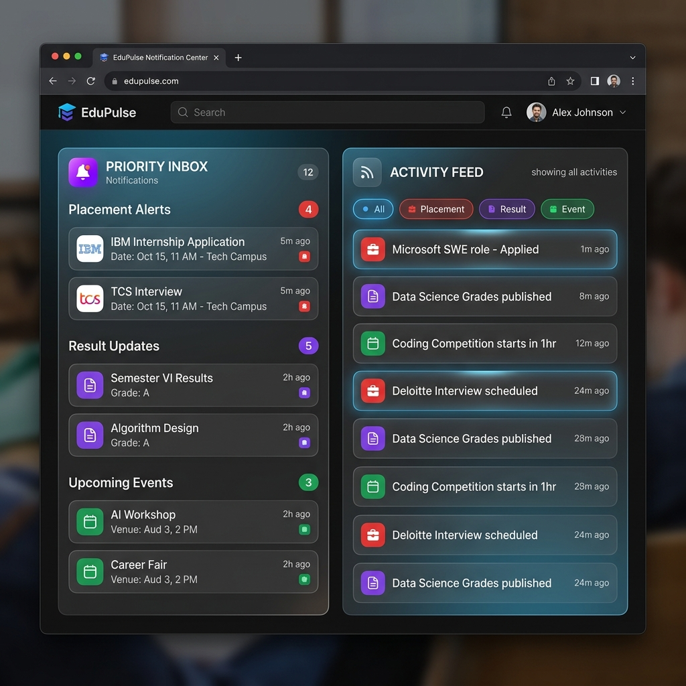

# Stage 1: REST API Design, Contract, and Structure

This document presents the system design, API contracts, database schema, scalability strategies, and priority sorting implementation for a student notification platform.

## 1. Core Actions
The notification platform supports the following core operations:
1. **Fetch Notifications**: Retrieve a paginated list of notifications for the logged-in student, optional filter by type (Event, Result, Placement) and read status.
2. **Mark as Read**: Mark a specific notification as read.
3. **Mark All as Read**: Mark all notifications for the logged-in student as read.
4. **Get Unread Count**: Retrieve the count of unread notifications for the user badge.
5. **Create Notification**: Triggered by admins or system events (e.g., new exam result or placement drive) to publish a notification to one or many students.
6. **Delete Notification**: Delete/dismiss a notification.

---

## 2. REST API Endpoints & Contracts

### Base Headers (Request)
```http
Authorization: Bearer <JWT_TOKEN>
Content-Type: application/json
Accept: application/json
```

### A. Fetch Notifications (GET)
Retrieve notifications for the authenticated student.

* **URL**: `/api/notifications`
* **Method**: `GET`
* **Query Parameters**:
  * `page` (optional, default: `1`): Page number.
  * `limit` (optional, default: `10`): Number of notifications per page.
  * `notification_type` (optional): Filter by type (`Event`, `Result`, `Placement`).
  * `is_read` (optional): Filter by read status (`true`, `false`).
* **Headers**: Required `Authorization` header containing the user's JWT token.

* **Success Response (200 OK)**:
```json
{
  "success": true,
  "data": {
    "notifications": [
      {
        "id": "d146095a-0d86-4a34-9e69-3900a14576bc",
        "type": "Result",
        "message": "Mid-semester examination results published.",
        "isRead": false,
        "createdAt": "2026-04-22T17:51:30.000Z"
      },
      {
        "id": "b283218f-ea5a-4b7c-93a9-1f2f240d64b0",
        "type": "Placement",
        "message": "CSX Corporation hiring drive is live.",
        "isRead": true,
        "createdAt": "2026-04-22T17:51:18.000Z"
      }
    ],
    "pagination": {
      "currentPage": 1,
      "totalPages": 5,
      "pageSize": 10,
      "totalItems": 48
    }
  }
}
```

---

### B. Mark Notification as Read (PUT)
Mark a specific notification as read.

* **URL**: `/api/notifications/:id/read`
* **Method**: `PUT`
* **Request Body**: None

* **Success Response (200 OK)**:
```json
{
  "success": true,
  "message": "Notification marked as read.",
  "data": {
    "id": "d146095a-0d86-4a34-9e69-3900a14576bc",
    "isRead": true,
    "readAt": "2026-06-10T07:15:00.000Z"
  }
}
```
* **Error Response (404 Not Found)**:
```json
{
  "success": false,
  "error": "Notification not found or access denied."
}
```

---

### C. Mark All Notifications as Read (PUT)
Mark all unread notifications of the logged-in student as read.

* **URL**: `/api/notifications/read-all`
* **Method**: `PUT`
* **Request Body**: None

* **Success Response (200 OK)**:
```json
{
  "success": true,
  "message": "All notifications marked as read.",
  "data": {
    "countAffected": 12
  }
}
```

---

### D. Get Unread Notifications Count (GET)
Fetch count of unread notifications for badge counts.

* **URL**: `/api/notifications/unread-count`
* **Method**: `GET`

* **Success Response (200 OK)**:
```json
{
  "success": true,
  "data": {
    "unreadCount": 5
  }
}
```

---

### E. Create Notification (POST)
System/Admin endpoint to issue a notification.

* **URL**: `/api/notifications`
* **Method**: `POST`
* **Headers**: Requires admin/service API key authentication.
* **Request Body**:
```json
{
  "studentIds": [1042, 1043], 
  "type": "Placement",
  "message": "Amazon SDE Mock Interview slots are open."
}
```

* **Success Response (210 Multi-Status / 201 Created)**:
```json
{
  "success": true,
  "message": "Notifications created successfully.",
  "data": {
    "notificationId": "81589ada-0ad3-4f77-9554-f52fb558e09d",
    "countCreated": 2
  }
}
```

---

### F. Delete Notification (DELETE)
Dismiss/Delete a specific notification.

* **URL**: `/api/notifications/:id`
* **Method**: `DELETE`

* **Success Response (200 OK)**:
```json
{
  "success": true,
  "message": "Notification deleted successfully."
}
```

---

## 3. Real-Time Notification Mechanism
To deliver notifications instantly to logged-in users, we will use **Server-Sent Events (SSE)**.

### Why SSE over WebSockets?
1. **Unidirectional Flow**: Notifications are server-to-client only. We do not need client-to-server messages in this flow. WebSockets is bi-directional, which introduces unnecessary complexity.
2. **Native HTTP Protocol**: SSE runs over standard HTTP/HTTPS. It works out of the box with HTTP/2 multiplexing, port 80/443, and does not require custom protocol negotiation. It traverses corporate firewalls, API Gateways, and load balancers much better than WebSockets.
3. **Built-in Auto-Reconnect**: The browser's native `EventSource` client automatically handles connection drops and reconnects with exponential backoff, passing the `Last-Event-ID` header so the server can push missed events.
4. **Resource Friendly**: Lighter on memory and CPU compared to full duplex WebSocket connections.

### Connection Workflow
1. Client establishes SSE connection at `GET /api/notifications/stream`.
2. The server keeps the HTTP connection open, setting response headers:
   ```http
   Content-Type: text/event-stream
   Cache-Control: no-cache
   Connection: keep-alive
   ```
3. Whenever a new notification is inserted in the DB for a student, the server publishes a message to a Redis Pub/Sub channel.
4. The SSE server instance listening to that channel formats the message and sends it down the socket stream:
   ```http
   event: notification
   data: {"id": "123", "type": "Result", "message": "Results Out", "createdAt": "2026-06-10T12:00:00Z"}
   ```

---

# Stage 2: Persistent Storage and DB Queries

## 1. Storage Choice: PostgreSQL
We suggest **PostgreSQL** (with a Redis caching layer) for storing notifications due to the following reasons:

1. **ACID Transactions**: Marking a notification as read and updating badge counts must be consistent and instantaneous.
2. **Relational Integrity**: Notifications are strictly tied to students. Foreign key constraints ensure that if a student profile is deleted, orphaned notifications are managed (e.g., cascade delete).
3. **Sophisticated Indexing**: PostgreSQL supports B-Tree, Hash, and GIN indexes, allowing fast compound indexing on `(student_id, is_read, created_at)`.
4. **Table Partitioning**: PostgreSQL supports native declarative partitioning. As notifications grow, we can partition the table by date (e.g., monthly partitions) or by ranges of `student_id`.

---

## 2. DB Schema

```sql
-- Create Enum for Notification Types
CREATE TYPE notification_type AS ENUM ('Event', 'Result', 'Placement');

-- Students Table (For relation reference)
CREATE TABLE students (
    student_id SERIAL PRIMARY KEY,
    name VARCHAR(100) NOT NULL,
    email VARCHAR(150) UNIQUE NOT NULL,
    created_at TIMESTAMP WITH TIME ZONE DEFAULT CURRENT_TIMESTAMP
);

-- Notifications Table
CREATE TABLE notifications (
    id UUID PRIMARY KEY DEFAULT gen_random_uuid(),
    student_id INT NOT NULL REFERENCES students(student_id) ON DELETE CASCADE,
    type notification_type NOT NULL,
    message TEXT NOT NULL,
    is_read BOOLEAN NOT NULL DEFAULT FALSE,
    created_at TIMESTAMP WITH TIME ZONE NOT NULL DEFAULT CURRENT_TIMESTAMP,
    read_at TIMESTAMP WITH TIME ZONE NULL,
    
    -- Foreign key constraint is explicit
    CONSTRAINT fk_student FOREIGN KEY (student_id) REFERENCES students(student_id)
);

-- Indexing Strategy (To optimize Stage 1 and 3 queries)
CREATE INDEX idx_notifications_student_unread_created 
ON notifications(student_id, is_read, created_at DESC);
```

---

## 3. High Volume Performance Bottlenecks & Solutions
As the data volume grows (e.g., 50,000,000+ notifications), several problems arise:

### Problem A: Slow Reads due to Table Scans and Index Bloat
* **Issue**: B-tree index sizes will exceed RAM capacity (buffer pool limit), forcing database engine to fetch index pages from disk, which causes heavy I/O read spikes.
* **Solution**: **Horizontal Table Partitioning (by Month)**. Create partitions like `notifications_y2026m04`, `notifications_y2026m05`. When querying, the database engine uses partition pruning to scan only the active month's partition.
* **Solution**: **Archival Strategy**. Run a nightly CRON job to move notifications older than 90 days to a cold storage system (e.g., AWS DynamoDB or compressed parquet files in S3) and delete them from PostgreSQL. This keeps the active DB table small and fast.

### Problem B: Write Contention (Locks & Transaction Logs)
* **Issue**: When HR triggers "Notify All" to 50,000 students, the DB performs 50,000 writes, causing locking on tables, slowing down read queries, and bloating the Write-Ahead Log (WAL).
* **Solution**: **Write Batching**. Instead of executing individual `INSERT` statements in a loop, write in batches of 1,000.
* **Solution**: **Read-Write Splitting**. Set up a PostgreSQL Read Replica. The frontend retrieves notifications from the replica database, while writes and status updates (mark as read) target the primary master database.

---

## 4. SQL Queries

### A. Fetch unread notifications for student 1042 (Paginated, Newest First)
```sql
SELECT id, type, message, created_at 
FROM notifications 
WHERE student_id = 1042 AND is_read = FALSE
ORDER BY created_at DESC 
LIMIT 10 OFFSET 0;
```

### B. Mark a notification as read
```sql
UPDATE notifications 
SET is_read = TRUE, read_at = NOW() 
WHERE id = 'd146095a-0d86-4a34-9e69-3900a14576bc' AND student_id = 1042;
```

### C. Mark all notifications as read for a student
```sql
UPDATE notifications 
SET is_read = TRUE, read_at = NOW() 
WHERE student_id = 1042 AND is_read = FALSE;
```

### D. Bulk Create Notifications (Batch Insert)
```sql
INSERT INTO notifications (student_id, type, message)
VALUES 
(1042, 'Result', 'Mid-term grades are published.'),
(1043, 'Result', 'Mid-term grades are published.');
```

---

# Stage 3: Query Analysis and Optimization Critique

## 1. Analysis of Existing Query
```sql
SELECT * FROM notifications
WHERE studentID = 1042 AND isRead = false
ORDER BY createdAt ASC;
```

### Is the query accurate?
* **Semi-accurate**: Technically, it filters by the correct student and read status, but sorting by `createdAt ASC` is counter-intuitive for notifications. Users expect **newest notifications first** (`DESC`).
* **Design Flaw**: Using `SELECT *` is bad practice. It retrieves columns that might not be needed (like `read_at` which is always NULL when `isRead = false`), increases network payload, and prevents PostgreSQL from executing index-only scans.

### Why is it slow?
1. **Full Table Scan (Sequential Scan)**: If there is no index on `studentID` or `isRead`, the engine must scan all 5,000,000 records to filter notifications for student 1042.
2. **Sorting Overhead**: The query orders by `createdAt ASC`. Without an index sorting by this column, PostgreSQL performs an in-memory/on-disk sort (using work_mem or temporary files), which is extremely slow.
3. **Data Volume**: 5,000,000 rows exacerbate the scanning and sorting costs.

---

## 2. Proposed Changes & Computational Cost
To optimize the query, we should:
1. Limit retrieved columns (avoid `SELECT *`).
2. Add a compound index:
   ```sql
   CREATE INDEX idx_notifications_student_unread_created 
   ON notifications(student_id, is_read, created_at DESC);
   ```

### Likely Computational Cost
* **Before optimization**: Time complexity is $O(N)$ for table scan plus $O(M \log M)$ to sort $M$ student records, where $N = 5,000,000$.
* **After optimization**: Index search complexity is $O(\log N)$ (binary B-Tree traversal). Since the index is pre-sorted, sorting cost drops to $O(1)$. Execution time drops from seconds to $<2$ milliseconds.
* **Storage cost**: The index will occupy around $80-120 \text{ MB}$ of disk space, which is negligible compared to the massive latency improvement.

---

## 3. Critique: "Add indexes on every column to be safe"
This advice is **highly ineffective and counterproductive** for the following reasons:
1. **Write Performance Degradation**: Every time a row is inserted, updated, or deleted, **every index on the table must be updated**. Having 6 indexes on a table will slow down inserts significantly.
2. **Disk and RAM Bloat**: Indexes take up valuable disk space and memory (buffer pool). If indexes are too large, they push active table data out of RAM, causing severe cache miss issues.
3. **Optimizer Inefficiency**: The database planner has to evaluate too many possible index paths, leading to higher query planning times.
4. **Redundancy**: A query filtering by multiple columns is optimized using a **compound index**, not multiple single-column indexes.

---

## 4. Query: Placement notifications in the last 7 days
Find all students who got a placement notification in the last 7 days.
```sql
SELECT DISTINCT student_id 
FROM notifications
WHERE type = 'Placement' 
  AND created_at >= NOW() - INTERVAL '7 days';
```
*(Note: We use `DISTINCT` to avoid returning duplicate student IDs if a student received multiple placement drives).*

---

# Stage 4: Fetch-on-Page-Load Scaling Strategies

Retrieving notifications directly from the DB on every single page load for 50,000 active students leads to database bottleneck. Below are solutions to solve this:

| Strategy | Implementation Details | Pros | Cons |
| :--- | :--- | :--- | :--- |
| **1. Caching Layer (Redis)** | Cache unread notifications count or the top 10 notifications for each user. Mark-as-read invalidates the cache. | Reduces database reads to nearly zero; sub-millisecond latencies. | Cache invalidation complexity; memory overhead in Redis. |
| **2. Real-Time Push (SSE / WebSocket) + Client State** | Establish SSE channel. Frontend fetches notifications **once** on initial load and keeps it in React state. New notifications are pushed in real-time. | Removes DB reads on page load completely; notifications appear instantly. | High number of open connections; requires horizontal scale of SSE servers. |
| **3. HTTP Conditional Headers (ETag)** | Use ETag based on student's last notification update timestamp. Returns `304 Not Modified` if nothing changed. | Drastically reduces JSON serialization and bandwidth usage. | Still requires a fast check on the server (though easily optimized with Redis). |
| **4. Client-side Storage (Local Session)** | Store current notification list in memory or sessionStorage. Only request new updates (delta) using a timestamp. | Extremely responsive UI; minimal network requests. | Syncing issues across multiple open tabs (can be fixed using BroadcastChannel API). |

### Recommended Hybrid Strategy:
Use **Redis caching** for unread counts + **SSE** for pushing updates. The client fetches the full list once on login, caches it in memory (React State), and listens to the SSE stream. Subsequent page loads check local state or query a Redis-backed API, avoiding the primary DB.

---

# Stage 5: Notify All Redesign

## 1. Shortcomings of Synchronous Implementation
```python
function notify_all(student_ids: array, message: string):
for student_id in student_ids:
    send_email(student_id, message)   # calls Email API
    save_to_db(student_id, message)   # DB insert
    push_to_app(student_id, message)  # real-time push
```
1. **Blocking & Timeouts**: Sending an email takes `100ms - 500ms`. For 50,000 students, the loop takes $50,000 \times 150\text{ms} = 7,500\text{ seconds}$ (~2 hours!). The HTTP connection will timeout within 30 seconds.
2. **Cascading Failure & State Loss**: If the email API or script crashes at index 20,100, the remaining 29,900 students do not receive anything. There is no resume/retry log.
3. **Email Throttling**: External services (SendGrid, Mailgun) will block requests due to rate limiting.
4. **Database Pool Exhaustion**: Doing 50,000 separate sequential insertions floods the DB pool.
5. **Coupled System**: Email delivery failure halts database inserts and SSE pushes, which is incorrect since email is secondary to DB state.

---

## 2. Mitigation of Partial Failures
If the script fails midway, we have no tracking.
* **Redesign Fix**: Introduce an **idempotent message queue**. If a chunk fails, the queue worker retries only the failed chunk. If an individual email fails, it is moved to a Dead Letter Queue (DLQ) for manual inspection, while DB writes remain successful.

---

## 3. REDESIGN: Asynchronous Queue Architecture

### Should DB write and email happen together?
**No.** Writing to the database is an internal, fast ($<5\text{ms}$) operation. Sending email is a slow ($100-500\text{ms}$), unreliable network call. Decoupling them ensures that in-app notifications are available instantly, while email workers handle SMTP queues asynchronously.

### Architecture Workflow
```
[HR Action: Notify All] 
         │
         ▼
[Express Server] ──(Creates Broadcast Record)──► [PostgreSQL]
         │
         ▼ (Enqueue Job in Redis)
[Redis / BullMQ Queue]
         │
         ├──────────────────────────┐
         ▼ (Worker 1)               ▼ (Worker 2)
   [DB & SSE Worker]          [Email Worker]
         │                          │
   ┌─────┴──────────┐               ├─────────────────────────┐
   ▼                ▼               ▼                         ▼
[Bulk DB Insert] [SSE Push]  [Batch Email Request]     [Failed Email Retry]
```

### Revised Pseudocode
```python
# API Endpoint handler
function notify_all_api(student_ids: array, message: string):
    # Step 1: Create a Broadcast Tracking Record in DB
    broadcast_id = db.create_broadcast(message, total_students=len(student_ids))
    
    # Step 2: Chunk students into batches of 1,000
    student_chunks = chunk_array(student_ids, chunk_size=1000)
    
    # Step 3: Push chunk jobs to the queue
    for chunk in student_chunks:
        queue.push("process_notification_batch", {
            "broadcast_id": broadcast_id,
            "student_ids": chunk,
            "message": message
        })
        
    # Return 202 Accepted immediately
    return response(status=202, body={"message": "Broadcast queued", "broadcast_id": broadcast_id})


# Worker Processor (Consuming from queue)
function process_notification_batch(job_data):
    broadcast_id = job_data.broadcast_id
    student_ids = job_data.student_ids
    message = job_data.message
    
    # 1. Bulk DB insertion (Fast, single query transaction)
    try:
        db.bulk_insert_notifications(student_ids, message)
    except Exception as e:
        # Retry entire batch DB insert
        log_error("DB write failed", e)
        throw e

    # 2. Trigger SSE Dynamic pushes
    for student_id in student_ids:
        sse_service.push_to_client(student_id, message)
        
    # 3. Enqueue individual email jobs (Allows fine-grained retries and rate limiting)
    for student_id in student_ids:
        email_queue.push("send_single_email", {
            "student_id": student_id,
            "message": message
        }, attempts=3, backoff="exponential")


# Email Worker Processor
function send_single_email(job_data):
    student_id = job_data.student_id
    message = job_data.message
    
    try:
        email_service.send(student_id, message)
    except RateLimitException:
        # Delay and retry
        throw RetryLater(delay=60)
    except Exception as e:
        log_error(f"Email failed for {student_id}", e)
        # Job naturally retries up to 3 times (with backoff), then goes to DLQ
        throw e
```

---

# Stage 6: Priority Inbox and Top N Maintenance

## 1. Priority Sorting Logic
Our priority algorithm determines importances based on:
1. **Weight**: `Placement` (Weight 3) > `Result` (Weight 2) > `Event` (Weight 1)
2. **Recency**: Newest timestamps rank higher.

### Javascript Implementation
To sort notifications, we normalize the types, assign numeric scores, and perform a multi-key comparison.
```javascript
const NOTIFICATION_WEIGHTS = {
  placement: 3,
  result: 2,
  event: 1
};

function getPriorityNotifications(notifications, n = 10) {
  return [...notifications]
    .sort((a, b) => {
      const weightA = NOTIFICATION_WEIGHTS[a.Type.toLowerCase()] || 0;
      const weightB = NOTIFICATION_WEIGHTS[b.Type.toLowerCase()] || 0;

      // 1. Primary Sort: Weight (Descending)
      if (weightB !== weightA) {
        return weightB - weightA;
      }

      // 2. Secondary Sort: Timestamp (Descending)
      return new Date(b.Timestamp) - new Date(a.Timestamp);
    })
    .slice(0, n);
}
```

---

## 2. Maintaining Top 10 Efficiently with High Volumes
Sorting all notifications on the fly is costly if done repeatedly. We can maintain the top 10 dynamically:

### Strategy A: Bounded Sorted List (Client-side / Memory)
Since $N = 10$ is small, we maintain a pre-sorted array of size 10. When a new notification arrives:
1. Perform a binary search to find the correct insertion index.
2. If index is $< 10$, insert the new notification at that index and pop the last element.
3. **Time Complexity**: $O(\log 10) = O(1)$ operations.

### Strategy B: Redis Sorted Set (ZSET)
In production, we can store each student's priority inbox in a Redis `ZSET`.
* **Score Design**: Score is calculated as:
  $$\text{Score} = (\text{Weight} \times 10^{13}) + \text{UnixTimestampSeconds}$$
  * Weight 3 (Placement) yields scores in the $3.0 \times 10^{13}$ range.
  * Weight 2 (Result) yields scores in the $2.0 \times 10^{13}$ range.
  * Weight 1 (Event) yields scores in the $1.0 \times 10^{13}$ range.
  * Because timestamps are in seconds (e.g., $1.7 \times 10^9$), they will not bleed into the weight digit.
* **Maintenance**:
  1. Add a new notification: `ZADD student:1042:priority <score> <notification_json>`.
  2. Trim the set to top 10: `ZREMRANGEBYRANK student:1042:priority 0 -11`.
  3. Fetch top 10: `ZREVRANGE student:1042:priority 0 9`.
* **Complexity**: Insertion and trimming take $O(\log M)$, where $M \le 11$. This is extremely efficient and database-free.

---

## 3. Priority Inbox UI Screenshot
Below is a screenshot of the EduPulse Notification Center displaying sorted priority notifications on a premium dark UI dashboard:


